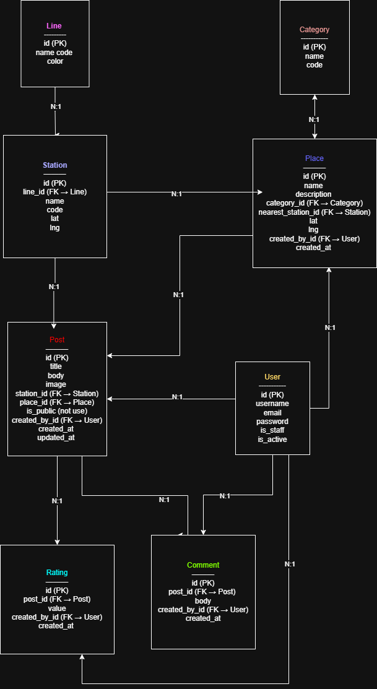

# Riyadh Metro — Backend (Django REST Framework + PostgreSQL)

This backend was built to power the *Riyadh Metro* web app.  
It provides all APIs for lines, stations, places, categories, posts, comments, and ratings — with full JWT authentication and user permissions.  
The backend was designed to handle real-time data connections between users and the metro system, while staying clean, scalable, and secure.

---

## Tech Stack
- *Django* & *Django REST Framework*
- *PostgreSQL* for database
- *SimpleJWT* for authentication
- *Pillow* for image uploads
- *CORS Headers* for frontend connection
- *Python 3.12*

---

##  Frontend Repository
 [Riyadh Metro Frontend ](https://git.generalassemb.ly/nawaalqahtani/RUH-Metro-frontend)

---

## ERD Diagram
Here’s the database structure for the Riyadh Metro backend.  
It shows the relationships between lines, stations, places, posts, comments, and ratings.

---

## Routing Table

*Base URL:* /api/

### Authentication
| Method | Endpoint | Description |
|--------|-----------|-------------|
| POST | /auth/register/ | Register a new user |
| POST | /auth/login/ | Login and get JWT tokens |
| POST | /auth/refresh/ | Refresh the access token |
| GET | /auth/me/ | Get the current logged-in user |

---

### Lines
| Method | Endpoint | Description |
|--------|-----------|-------------|
| GET | /lines/ | List all lines |
| POST | /lines/ | Create a new line (Admin) |
| GET | /lines/:id/ | Retrieve one line |
| PUT/PATCH | /lines/:id/ | Update a line (Admin) |
| DELETE | /lines/:id/ | Delete a line (Admin) |

---

###  Stations
| Method | Endpoint | Description |
|--------|-----------|-------------|
| GET | /stations/ | List all stations |
| POST | /stations/ | Create a new station (Admin) |
| GET | /stations/:id/ | Retrieve one station |
| PUT/PATCH | /stations/:id/ | Update station (Admin) |
| DELETE | /stations/:id/ | Delete station (Admin) |
| GET | /stations/nearest?lat=&lng= | Get the nearest station using coordinates |

---

### Categories & Places
| Method | Endpoint | Description |
|--------|-----------|-------------|
| GET | /categories/ | List all categories |
| POST | /categories/ | Add category (Admin) |
| GET | /places/ | List all places |
| POST | /places/ | Add a place (Authenticated) |
| GET | /places/:id/ | Retrieve place details |
| PUT/PATCH | /places/:id/ | Update place (Owner/Admin) |
| DELETE | /places/:id/ | Delete place (Owner/Admin) |

---

### Posts, Comments & Ratings
| Method | Endpoint | Description |
|--------|-----------|-------------|
| GET | /posts/ | List all posts |
| POST | /posts/ | Create a new post (Auth) |
| GET | /posts/:id/ | Retrieve post details |
| PUT/PATCH | /posts/:id/ | Update post (Owner) |
| DELETE | /posts/:id/ | Delete post (Owner/Admin) |
| GET | /posts/:id/comments/ | List all comments |
| POST | /posts/:id/comments/ | Add comment (Auth) |
| POST | /posts/:id/rate/ | Rate a post (Auth) |

---

## IceBox Features

- *Profile Page* — show user’s saved places, posts, and activity.  
- *Notification System* — alert users about new routes or crowded stations.  
- *AI Chatbot* — answer questions like “Where should I stop?” or “What’s near my location?”.  
- *Real-time Metro Data* — show live train tracking and schedules.  
- *Multiple Image Uploads* — allow posts and places to have photo galleries.  
- *Search & Filter Improvements* — better explore experience for users.  
- *Admin Dashboard* — manage lines, stations, and reports easily.

